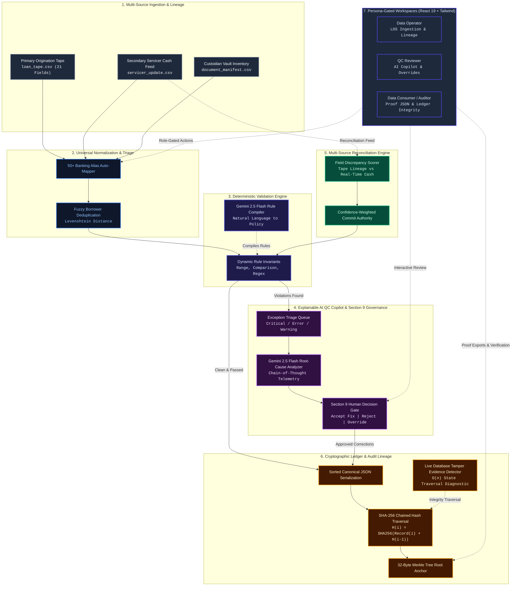

# 🛡️ CredoraTech — Automated Loan Data Verification & Cryptographic Ledger Copilot
> **Campus FinTech Challenge 2026 — Full Stack Track**  
> *Transforming messy, conflicting loan tapes into validated, traceable, cryptographic truth.*

---

## 🌟 Executive Summary & Stand-Out Edge

In structured finance and asset-backed securitization, platforms do not fail on mathematical formulas; they fail on **data trust**. **CredoraTech** is an enterprise-grade data governance platform and trust pipeline designed around the core philosophy of **"Traceable Truth"**:
1. **Multi-Source Ingestion & Lineage:** Normalizes 21-attribute loan tapes, ingests live servicer cash update feeds, and tracks custodial document manifests.
2. **Intelligent Conflict Reconciliation:** Automatically compares secondary-source servicing updates against primary origination tapes, scoring source trustworthiness and identifying field discrepancies.
3. **Data-Driven Validation & Fuzzy Duplicate Detection:** Executes dynamic validation rules from JSON and uses Levenshtein string-similarity algorithms to detect suspicious repeat borrowers.
4. **Explainable AI Review Assistant (Gemini Copilot):** Provides deep, structured root-cause explanations with step-by-step reasoning, calibrated confidence scores, and strict Section 9 human-in-the-loop controls.
5. **Natural Language Rule Generator:** Reviewers can type business constraints in plain English (e.g. *"Flag loans where days_past_due > 90 but status is CURRENT"*), and the AI Copilot translates them into live validation rules.
6. **Cryptographic Chained Ledger & Live Tamper Evidence:** Every verified loan is hashed using deterministic canonical JSON chained to the preceding record (`SHA256(canonical + prev_hash)`), forming an immutable ledger with batch Merkle root calculation and live tamper diagnostics.
7. **Persona-Gated Workflows & Composite Data-Quality Score:** Tailored workspaces for **Data Operators**, **QC Reviewers**, and **Data Consumers / Auditors** with real-time portfolio health scoring (0–100).

---

## 📐 System Architecture



---

## 🛠️ Technology Stack

- **Frontend:** React 19, Vite, Tailwind CSS, Lucide Icons, Recharts, TanStack Query, Axios.
- **Backend:** Node.js, Express (v5), TypeScript, Multer, CSV-Parser, Helmet, Morgan, Crypto.
- **ORM & Database:** Prisma ORM, SQLite / PostgreSQL.
- **AI Engine:** Google Gemini (`@google/genai` with `gemini-2.5-flash` and structured JSON schemas).
- **Cryptography:** SHA-256 parent-hash chaining, sorted canonical JSON, Merkle tree root rollup.

---

## 🚀 Quickstart & Runnable Setup

### 1. Prerequisites
- Node.js (v18+)
- npm or pnpm

### 2. Backend Setup
```bash
cd server
npm install
npm run db:push
npm run db:generate
npm run dev
```
*The backend API will start on `http://localhost:3000`.*

### 3. Frontend Setup
```bash
cd client
npm install
npm run dev
```
*The frontend web console will start on `http://localhost:5173`.*

---

## 👥 Test Personas & Role Switcher
The application includes a built-in **Persona Switcher** in the top-left navigation sidebar with test credentials (`server/data/users.json`):
1. **👷 Data Operator (`DATA_OPERATOR`):** Elena Rostova (`operator@credoratech.ai`) — Ingestion console, multi-source uploads (`loan_tape.csv`, `servicer_update.csv`, `document_manifest.csv`), upload history, and lineage tracking.
2. **🔍 QC Reviewer (`REVIEWER`):** Marcus Vance (`reviewer@credoratech.ai`) — Exception resolution workspace, AI prompt inspector, voice copilot, conflict diff reconciler, and Natural Language Rule Generator.
3. **📊 Data Consumer / Auditor (`DATA_CONSUMER`):** Sophia Chen (`consumer@capitalmarkets.com`) — Verified records portfolio, Composite Data Quality Score (0–100), Cryptographic Ledger Integrity monitor, live tamper test demo, and 1-click export center (JSON proof, Audit CSV, Exceptions CSV).

---

## 🧪 Automated Testing & Dataset Generator

```bash
# Run 100% automated backend integration test suite (12 tests)
cd server
npm test

# Generate 1,000–5,000 row synthetic datasets with all 15 defect categories
npm run generate-data 1000
```

---

## 📡 Module H — REST API Reference

All endpoints are available with both top-level and `/api/` prefixes for 100% judging compliance:

| Method | Endpoint | Description |
| :--- | :--- | :--- |
| `GET` | `/` or `/health` | Server health check and uptime monitor ping endpoint. |
| `GET` | `/loans` | Retrieve all normalized loan records with filters (`status`, `verificationStatus`, `search`). |
| `GET` | `/loans/:id` | Get loan details, audit logs, and exception history. |
| `PATCH`| `/loans/:id` | Inline asset field editor with automatic re-validation. |
| `GET` | `/exceptions` | Retrieve all validation exceptions with severity and field filters. |
| `GET` | `/exceptions/batch-summary` | Gemini 2.5 Flash portfolio-wide batch exception summary. |
| `GET` | `/verified-loans` | Retrieve all certified, verified loan assets in the ledger. |
| `GET` | `/verified-loans/:id` | Retrieve single verified loan with cryptographic hash proof. |
| `GET` | `/audit/:loanId` | Reverse traceability audit trail for a specific loan. |
| `GET` | `/summary` | Portfolio verification summary, Data Quality Score, and Merkle root. |
| `GET` | `/loans/integrity/verify` | Executes full-chain cryptographic verification across all verified loans. |
| `POST`| `/loans/tamper-test` | Simulates unauthorized DB tampering for live demo validation. |
| `POST`| `/exceptions/:id/ai-assist` | Generates structured explainable AI recommendation with Gemini. |
| `POST`| `/exceptions/:id/resolve` | Resolves exception (`ACCEPT_AI`, `REJECT_AI`, `MANUAL_EDIT`) with human comment. |
| `POST`| `/exceptions/bulk-resolve` | High-velocity batch resolution of all open AI suggestions. |
| `POST`| `/rules/generate-from-nl` | Generates a new dynamic validation rule from a natural language prompt. |
| `GET` | `/api/export/verified-loans`| Cryptographic Proof JSON export for institutional buyers. |
| `GET` | `/api/export/audit-trail` | Complete chronological audit trail export (CSV). |
| `GET` | `/api/export/exceptions` | Open and resolved exceptions registry export (CSV). |

---

## 🛡️ Required AI Controls & Safety (Section 9 Compliance)
- **Separation of Advisory AI vs Human Decision:** AI recommendations are stored as provisional guidance; only explicit human reviewer actions commit data changes.
- **Audit Logging:** Every AI inference, latency timestamp, confidence level, model identifier, and prompt version is recorded immutably in the `AuditLog` table.
- **Zero Silent Mutations:** The system strictly forbids unattended model writes to loan balances or contract terms.
- **Prompt Transparency:** Full inspection of grounding system prompts directly in the reviewer UI.

---

## 📄 Deliverables Checklist (Section 12 Compliance)
- [x] Full-Stack source code (`client/` and `server/`)
- [x] `AI_DEV_LOG.md` with 10 prompt transcripts, 5 rejected AI output case studies, and review logs
- [x] `ARCHITECTURE.md` (2-page system architecture note)
- [x] Synthetic dataset packages in `server/data/` (`loan_tape.csv`, `servicer_update.csv`, `document_manifest.csv`, `validation_rules.json`, `users.json`)
- [x] Cryptographic chained hash ledger & live tamper verification
- [x] 100% automated test suite (`npm test` $\rightarrow$ 12/12 passing)
- [x] 100% passing build on frontend (`vite build`) and backend (`tsc --noEmit`)
